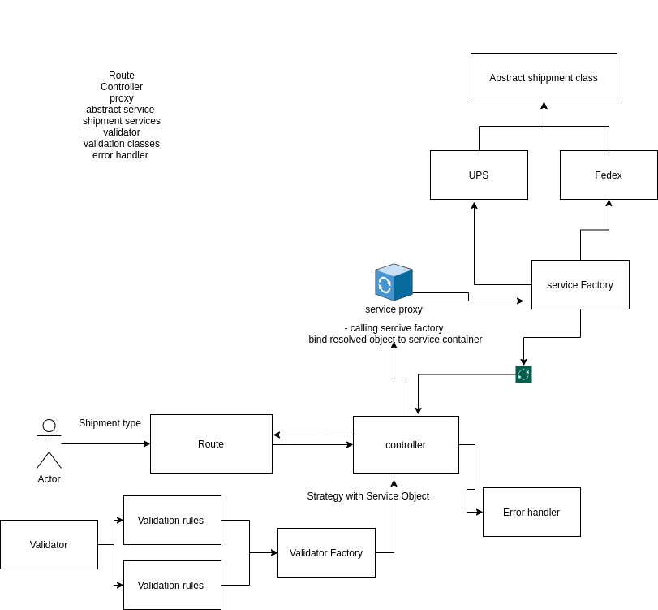

<h3 align="center">
<b>Shipment Service</b></h3>

Shipment service is a single api service that takes the responsibility of validating a booking a shipment service service logic.
The service is built with typescript and follows a custom file structure <br>

## 📝 Table of Contents

- [Getting Started](#getting_started)
- [Code Structure](#code_structure)
- [Tests](#tests)

### Prerequisites

What things you need to install the software and how to install them.

- [Docker](https://www.docker.com/) for running app containers.
- [npm](https://www.npmjs.com/) - Package manager (" To run unit tests outside the docker container").
- [tsc](https://www.typescriptlang.org) for compiling typescript files to javascript.
- [ts-node](https://www.npmjs.com/package/ts-node) for running typescript files while development.

## 🏁 Getting Started <a name = "getting_started"></a>

- Running locale <br>
  we have two ways to run the project locally.
  - Using ts_node <br>
    --> Install ts_node<br>
    --> run `npm install` for installing app dependance<br>
    --> run `npm run test` to test project components<br>
    --> run `npm start` to run project <br>
  - Using tsc
    -->Install tsc<br>
    --> run `npm run build` to build the dist folder<br>
    --> run `node ./dist/index.js` to start the built files<br>
    --> or start the project using pm2 by using `npm run deploy` command.
- Running using Docker <br>
  - building the image<br>
    --> run `docker build -t shipment:v1` .<br>
    --> run `docker run -p 3001:3001 shipment:v1`.<br>
  - pull the image from docker hub<br>
    --> run `docker pull galoomba12/shipmentservice:v1` .<br>
    --> run `docker run -p 3001:3001 galoomba12/shipmentservice:v1`.<br>

## 🚀 Code Structure <a name = "code_structure"></a>



### Request flow

`Router` receiving the request and passing it to the -> `Controller`<br>
`Controller` Constructor is returning a proxy that get triggered before every controller function invocation. <br>
`Container Proxy` -> invokes the `Shipment Factory` dynamically before every method call and bind a shipment object to the controller method based on the shipment type.<br>
`Service Factory` -> loads an instance of the shipment classes based on the shipment type from the `ShipmentTypeEnum` If the `Service Factory` Fails to load the shipment type it throws `TypeNotFoundException` exception<br><br><br>

A shipment Object will be passed to the controller method params, Then the controller method init the `Validator Factory` sending the ` shipment object` as a param to it's constructor.<br>
Based on the Object that is based to the Factory it will return a validator class that should contain the validation logic on it's `Validate` method.<br>

The `Validation Class` will retrieve the `service rules` and the `data object` in order to validate wither the data object is corrupted or not.<br>
If any of the rules is being violated it will populate the errors array with the violation and throw a `CorruptedObjectException` exception <br><br><br>

If the object passes the validation checks, the shipment ` save ()` method is invoked and a 200 status code response is send.<br>

If any exception where thrown during request life cycle, It will be passed to the `Error Handler` which will map the error response and send it back.

## 🔧 Running the tests <a name = "tests"></a>

The project is using ts-mocha to run the test cases.

- run `npm test`

```
  Shipment
    Shipment Factory
      ✔ Should return instance of Shipment Class  according to shipment type
      ✔ Should return instance of Shipment Class  according to shipment type x2
      ✔ Should not return instance of other shipment type class
      ✔ Should throw exception incase of  not found
      Factory instance data Object
        ✔ Should has the same data object send to factory
    Shipment Classes save logic
      ✔ Should console log UPS saved!
      ✔ Should console log Fedex saved!

  Shipment Validation
    Validation Factory
      ✔ Should return instance of UPS Validator
      ✔ Should return instance of Fedex Validator
      ✔ Should return return void as object rules are not violated
    Validation classes exceptions
      Validate Fedex data object
        ✔ Should throw exception of type CorruptedObjectException
        ✔ Should throw exception of type CorruptedObjectException
        ✔ Should throw exception of type CorruptedObjectException
      Validate UPS data object
        ✔ Should throw exception of type CorruptedObjectException
        ✔ Should throw exception of type CorruptedObjectException
        ✔ Should throw exception of type CorruptedObjectException


  16 passing (8ms)


```

#### Note: before you run and test make sure that you install all the dependance `npm install`

## 🔧 Request examples

- Successful Request

```
   curl -i  --location --request POST 'http://localhost:3001/Fedex' \
    --header 'Content-Type: application/json' \
    --data-raw '{
        "carrierServiceId": "fedexAIR",
        "width": "10 cm",
        "height": "10 cm",
        "length": "10 cm",
        "weight": "10 gram"
    }'
    HTTP/1.1 200 OK
    X-Powered-By: Express
    Content-Type: text/plain; charset=utf-8
    Content-Length: 2
    ETag: W/"2-nOO9QiTIwXgNtWtBJezz8kv3SLc"
    Date: Thu, 10 Jun 2021 12:25:07 GMT
    Connection: keep-alive
    Keep-Alive: timeout=5

    OK%
    ----------------------------------------------------------------
    curl -i --location --request POST 'http://localhost:3001/UPS' \
    --header 'Content-Type: application/json' \
    --data-raw '{
        "shipmentServiceId": "UPSExpress",
        "width": "10 inch",
        "height": "10 inch",
        "length": "10 inch",
        "weight": "10 pound"
    }'
    HTTP/1.1 200 OK
    X-Powered-By: Express
    Content-Type: text/plain; charset=utf-8
    Content-Length: 2
    ETag: W/"2-nOO9QiTIwXgNtWtBJezz8kv3SLc"
    Date: Thu, 10 Jun 2021 12:30:57 GMT
    Connection: keep-alive
    Keep-Alive: timeout=5

    OK%
```

- Failed Requests

```
    curl -i --location --request POST 'http://localhost:3001/Fedex' \
    --header 'Content-Type: application/json' \
    --data-raw '{
        "carrierServiceId": "fwrong name",
        "width": "10 cm",
        "height": "10 cm",
        "length": "10 cm",
        "weight": "10 wrongunit"
    }'
    HTTP/1.1 422 Unprocessable Entity
    X-Powered-By: Express
    Content-Type: application/json; charset=utf-8
    Content-Length: 125
    ETag: W/"7d-3fRMJovlVirUh6ZsYFWbOC9v9xA"
    Date: Thu, 10 Jun 2021 12:27:46 GMT
    Connection: keep-alive
    Keep-Alive: timeout=5

    {"message":"Object Corrupted","errors":[{"carrierServiceId":"Wrong shipment service id !"},{"weight":"Wrong weight unit !"}]}%
    ----------------------------------------------------------------
    curl -i --location --request POST 'http://localhost:3001/UPS' \
    --header 'Content-Type: application/json' \
    --data-raw '{
        "shipmentServiceId": "UPSExpresssssssss",
        "width": "10 cm",
        "height": "10 inch",
        "length": "10 inch",
        "weight": "10 gram"
    }'
    HTTP/1.1 422 Unprocessable Entity
    X-Powered-By: Express
    Content-Type: application/json; charset=utf-8
    Content-Length: 156
    ETag: W/"9c-FpK52hCOzU8cpji48PUgWUaev3g"
    Date: Thu, 10 Jun 2021 12:32:44 GMT
    Connection: keep-alive
    Keep-Alive: timeout=5

    {"message":"Object Corrupted","errors":[{"shipmentServiceId":"Wrong carrier service id !"},{"width":"Wrong width unit !"},    {"weight":"Wrong weight unit !"}]}%
```
